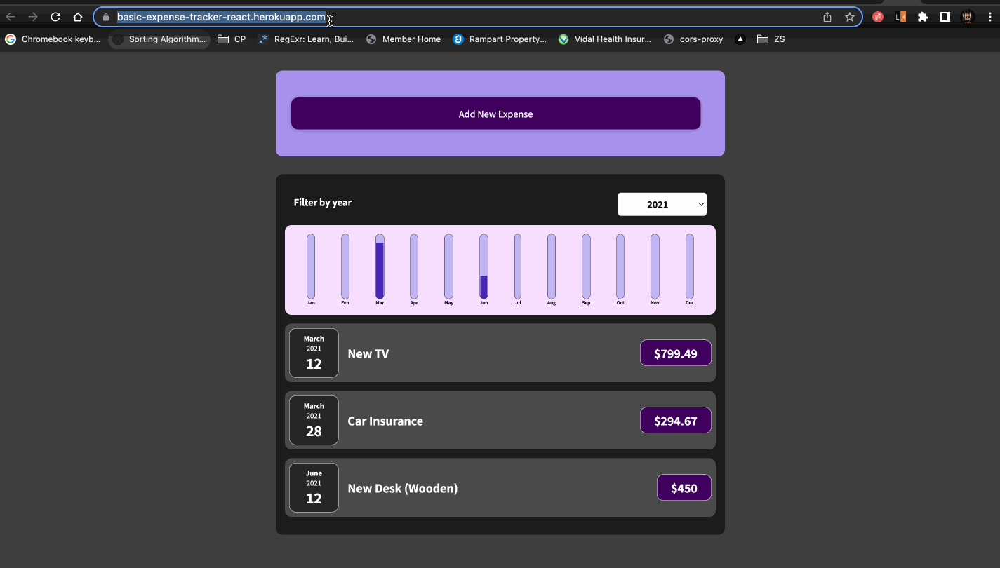

## Expense Tracker

Visit [here](/src) to view the source code

### Hands On!

You can try hands-on on the project [here](https://basic-expense-tracker-react.herokuapp.com/)

### Working Video

### Features

- Add an expense using a form
- List all the expenses in chronological order of occurrence.
- Show a graphical representation of the number of expenses each month
- Filter expense items based on the year selected.

### Scope for Improvement

- The state of a expense items is not stored in the local storage, which can be implemented